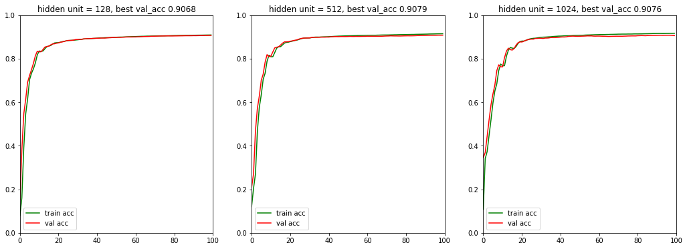
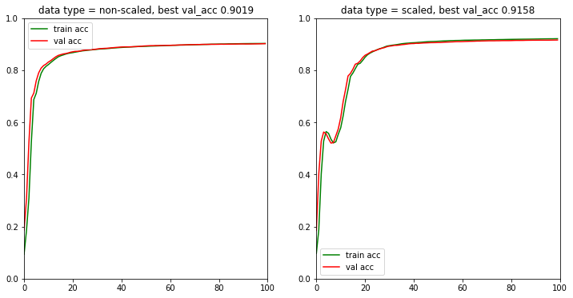
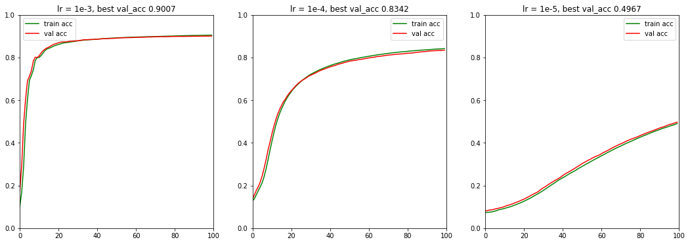
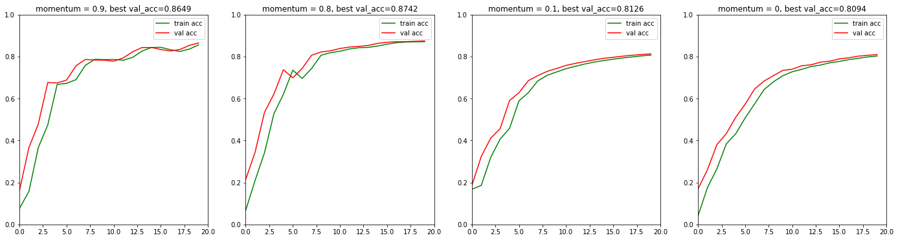

<h1 style="text-align: center">  MNIST Classification Using Multi Layer Perceptrons
 </h1>

<small>Feb 16 2020</small>

`Name:` Nguyen Truong Phat

# Introduction
Everyday we've been surveilled and manipulated by Artificial Intelligence, observed by the greatest human-made brain equipped with reasoning-ready algorithm. Let's take a look, AI has just been bombarded for less than a decade, since Neural Network took place in 2012 with AlexNet after declared missing for half a century. [1]

# Neural Network
A typical neural network objective is to find parameterized function represented by deeply stacked non-linear transforming layers, matching one input tensor to target tensor, respected to objective function called the "loss function".

## Two-layer layer Perceptron
In this assignment, we'll learn to implement a simple neural network, with only 2 hidden layers. [2]

Let:
- the input data be $X \in \mathcal{R}^{m\times D}$
- the target be $y \in \mathcal{R}^{ m\times n_o}$
- the weights matrix of hidden layer be $W^{[1]} \in R^{n_h\times D} $
- the biases of hidden layer be a column vector $b^{[1]} \in \mathcal{R}^{h} $
- the weights matrix of output layer be $W^{[2]} \in R^{n_o\times n_h} $
- the biases of output layer be a column vector $b^{[2]} \in \mathcal{R}^{n_o} $

We perform feed-forward:

$$
Z^{[1]} = W^{[1]}X^T\\
A^{[1]} = \text{relu}(Z^{[1]})\\
Z^{[2]} = W^{[2]}A_1 \\
\hat{y} = A^{[2]} = \text{softmax}(Z^{[2]})
$$

We then calculate the loss function based on cross entropy:
$$
\mathcal{L}(\hat{y},y) = mean[y\odot log(\hat{y})] \\
$$

We're interested in finding $W^{[1]}$, $b^{[1]}$,$W^{[2]}$,$b^{[2]}$ that minimize $\mathcal{L}(\hat{y},y) $

$$
W^{[1]},b^{[1]},W^{[2]},b^{[2]}=\underset{W^{[1]},b^{[1]},W^{[2]},b^{[2]}}{\text{argmin}}\mathcal{L}(\hat{y},y)
$$

Since the  $\mathcal{L}(\hat{y},y)$ is differentiable, gradient descent is a good choice. In gradient descent, we first calculate derivatives of $\mathcal{L}$ which respected to $W^{[1]},b^{[1]},W^{[2]},b^{[2]}$ by the following steps:

$$
\frac{\partial\mathcal{L}}{\partial Z^{[2]}}=\frac{1}{m}(\hat{y}-y)\\
\frac{\partial\mathcal{L}}{\partial W^{[2]}}=\frac{\partial\mathcal{L}}{\partial Z^{[2]}}\hat{y}^T\\
\frac{\partial\mathcal{L}}{\partial b^{[2]}} = sum(\frac{\partial\mathcal{L}}{\partial Z^{[2]}},\text{axis=1})\\
\frac{\partial\mathcal{L}}{\partial Z^{[1]}} = W^{[2]T}\frac{\partial\mathcal{L}}{\partial Z^{[2]}}\odot \frac{\partial\mathcal{relu}}{\partial Z^{[1]}}\\
\frac{\partial\mathcal{L}}{\partial W^{[1]}}=\frac{\partial\mathcal{L}}{\partial Z^{[1]}}X\\
\frac{\partial\mathcal{L}}{\partial b^{[1]}} = sum(\frac{\partial\mathcal{L}}{\partial Z^{[1]}},\text{axis=1})\\
$$

We then update the weights corresponding to the their derivatives:

$$
W^{[1]} := W^{[1]} - \alpha \frac{\partial\mathcal{L}}{\partial W^{[1]}} + \gamma(W^{[1]}-W^{[1]}_{old}) \\
W^{[2]} := W^{[2]} - \alpha \frac{\partial\mathcal{L}}{\partial W^{[2]}} + \gamma(W^{[2]}-W^{[2]}_{old})
$$
where $ \alpha$ is the learning rate and $\gamma$ is the momentum of the update iteration.
# Experimental Analysis

For experimental analysis, I conduct 4 main categories of analyzing: 

## 1. Changing hidden inputs

The bigger the network, the more it is able to represent complex data distribution and also more prone to over-fitting. 

## 2. Changing input scaling 

Training with scaled data warms up a little slower but at the end converges faster and has better accuracy.

## 3. Changing learning rate

The larger the learning rate, the faster the training process will go,.. unless it's too large.

## 4. Changing momentum 

Momentum helps the model converge much faster. However, make sure to choose the right momentum (large enough) or you will really mess up the training model.

## In-depth analysis

We pick the best model to conduct in-depth analysis with the following specifications:
- Using normalized data
- 64 hidden units
- 85 epochs
- momentum = 0.8
- learning_rate = 0.6 

###  Confusion Matrix

| Class | 0    | 1    | 2    | 3    | 4    | 5    | 6    | 7    | 8    | 9    |
| ----- | ---- | ---- | ---- | ---- | ---- | ---- | ---- | ---- | ---- | ---- |
| 0     | 958  | 0    | 1    | 2    | 0    | 2    | 8    | 3    | 5    | 1    |
| 1     | 0    | 1110 | 3    | 2    | 0    | 2    | 4    | 2    | 12   | 0    |
| 2     | 8    | 7    | 920  | 17   | 11   | 2    | 11   | 11   | 40   | 5    |
| 3     | 3    | 0    | 20   | 917  | 0    | 29   | 1    | 12   | 22   | 6    |
| 4     | 1    | 1    | 4    | 1    | 916  | 0    | 11   | 3    | 8    | 37   |
| 5     | 11   | 4    | 2    | 34   | 13   | 755  | 18   | 7    | 40   | 8    |
| 7     | 2    | 7    | 23   | 8    | 7    | 2    | 0    | 942  | 5    | 32   |
| 6     | 13   | 3    | 6    | 1    | 9    | 12   | 909  | 3    | 2    | 0    |
| 8     | 6    | 6    | 5    | 26   | 19   | 27   | 9    | 9    | 869  | 7    |
| 9     | 9    | 9    | 1    | 11   | 39   | 9    | 1    | 25   | 7    | 898  |

We can see top 5 cases of misclassification:

- class 2 and 5 is usually misclassified as class 8, with 40 wrongly labeled instances each
- 9 occasionally is misclassified as 4 with 39 cases and vice versa with 37 cases
- 7 sometimes is misclassified as 9 with 32 cases. 

### Brief report

|Class| Precision | Recall | F1   | Correct? |
|---|-----------|--------|------|----------|
| 0 | 0.95      | 0.98   | 0.96 | 980      |
| 1 | 0.97      | 0.98   | 0.97 | 1135     |
| 2 | 0.93      | 0.89   | 0.91 | 1032     |
| 3 | 0.90      | 0.91   | 0.90 | 1010     |
| 4 | 0.91      | 0.93   | 0.92 | 982      |
| 5 | 0.90      | 0.85   | 0.87 | 892      |
| 6 | 0.94      | 0.95   | 0.94 | 958      |
| 7 | 0.93      | 0.92   | 0.92 | 1028     |
| 8 | 0.86      | 0.89   | 0.88 | 974      |
| 9 | 0.90      | 0.89   | 0.90 | 1009     |

**Sum up:** The most correctly classified class is 1 with 0.97 F-score whereas class 5 performs the worst at 0.87 F-score.

# Q&A

> How does the number of hidden units affect the training?

- Increasing hidden units tends to increase model's performance, however the model is more proned to overfitting if trained long enough.

> Is there any correlation between the number of hidden units and the number of epochs?

 - No and yes. No is because those are hyperparameters at users' choice. However, yes is because bigger networks are more proned to overfitting, that's why we need early-stopping which results in less number of epochs.

> Did your scaling affect your network’s performance?

- Yes . Training on scaled data warms up slower than original one, however, ends up converging faster and yields higher both training and validation accuracy.  

> What is the effect of momentum factor’s value? Is there increase/decrease in term of accuracy? In number of epoch?

- Momentum helps the model converge faster with less epochs, thus yields higher accuracy in warming-up phase. Momentum has to be large enough for the model to converge fast but not to big to mess up the training.

> Did your network over-fit?

- I can say it's not that much, there's a small sign of over-fitting happened around 100th epoch with 1024 hidden units: The validation accuracy decreases while the training accuracy keeps increasing. Since we did experiments with at most 100 epochs so we didn't have a chance to see overfitting appear so clearly, but if we'll train further with more epochs (150+) it will likely to overfit the training data.

# Implementation

You can access to the experimental notebook at [this link](https://drive.google.com/file/d/1KVEaFuneRvtMBn08q0smpgGOLL1OnfPs/view?usp=sharing).
Please kindly include `MLP.py` to the notebook to run properly

# References 

[1] [Aditya Raj - It all started with— CNN’s & AlexNet](https://medium.com/@adityaraj_64455/it-all-started-with-cnns-alexnet-3023b21bb891)
[2] Cristopher Bishop. Pattern Recognition and Machine Learning. Springer,
2006.